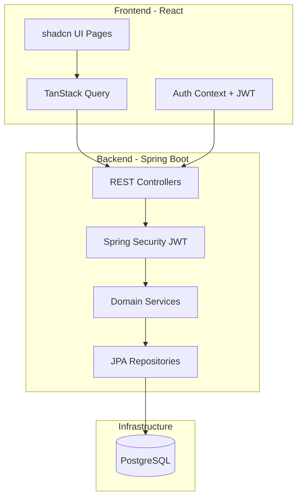

# Mini Doodle — Architecture

## 1. System Overview

Mini Doodle is a monorepo full-stack application for meeting scheduling.

```
custom-doodle/
├── backend/          # Spring Boot API
├── frontend/         # React SPA
├── docker-compose.yml
├── docs/
└── README.md
```

## 2. Architecture Diagram



## 3. Domain Model

```mermaid
erDiagram
    User ||--|| Calendar : owns
    Calendar ||--o{ TimeSlot : contains
    TimeSlot ||--o| Meeting : may_have
    Meeting ||--o{ MeetingParticipant : has
    User ||--o{ MeetingParticipant : may_be

    User {
        uuid id PK
        string email UK
        string passwordHash
        string displayName
        timestamp createdAt
    }
    Calendar {
        uuid id PK
        uuid userId FK UK
    }
    TimeSlot {
        uuid id PK
        uuid calendarId FK
        timestamp startAt
        timestamp endAt
        enum status
        int version
    }
    Meeting {
        uuid id PK
        uuid timeSlotId FK UK
        string title
        string description
        uuid organizerId FK
        enum status
    }
    MeetingParticipant {
        uuid id PK
        uuid meetingId FK
        uuid userId FK
        string email
    }
```

### Enums

| Enum | Values |
|------|--------|
| `SlotStatus` | `FREE`, `BUSY` |
| `MeetingStatus` | `SCHEDULED`, `CANCELLED` |

### Business Rules

1. One `Calendar` per `User` (auto-created on registration).
2. Only `FREE` slots can be booked as meetings.
3. Booking sets slot to `BUSY` and creates a `Meeting` with status `SCHEDULED` (at most one scheduled meeting per slot).
4. Cancelling a meeting sets slot back to `FREE`.
5. Overlapping slots for the same calendar are rejected.
6. All timestamps stored in UTC.

## 4. API Reference

Base URL: `http://localhost:8080/api/v1`

### Authentication

| Method | Path | Description |
|--------|------|-------------|
| POST | `/auth/register` | Create account |
| POST | `/auth/login` | Login, returns access token; sets refresh cookie |
| POST | `/auth/refresh` | Refresh access token |
| POST | `/auth/logout` | Clear refresh cookie |
| GET | `/auth/me` | Current user profile |

### Time Slots

| Method | Path | Description |
|--------|------|-------------|
| GET | `/slots?from=&to=` | List user's slots in range |
| POST | `/slots` | Create slot |
| GET | `/slots/{id}` | Get slot |
| PATCH | `/slots/{id}` | Update slot |
| DELETE | `/slots/{id}` | Delete slot |
| PATCH | `/slots/{id}/status` | Set FREE or BUSY |

### Meetings

| Method | Path | Description |
|--------|------|-------------|
| POST | `/slots/{slotId}/meeting` | Book meeting on free slot |
| GET | `/meetings` | List user's meetings |
| GET | `/meetings/{id}` | Get meeting |
| PATCH | `/meetings/{id}` | Update meeting |
| DELETE | `/meetings/{id}` | Cancel meeting |

### Availability

| Method | Path | Description |
|--------|------|-------------|
| GET | `/availability?userIds=&from=&to=` | Aggregated free/busy |

### Users

| Method | Path | Description |
|--------|------|-------------|
| GET | `/users/search?q=` | Search users for participant picker |

### Operations

| Method | Path | Description |
|--------|------|-------------|
| GET | `/actuator/health` | Health check |
| GET | `/actuator/prometheus` | Metrics |
| GET | `/swagger-ui.html` | API documentation |

### Error Format

RFC 9457 Problem Details:

```json
{
  "type": "https://api.minidoodle.com/errors/slot-overlap",
  "title": "Slot overlap",
  "status": 409,
  "detail": "The requested time range overlaps with an existing slot.",
  "instance": "/api/v1/slots"
}
```

## 5. Database Indexes

```sql
CREATE INDEX idx_time_slots_calendar_range ON time_slots (calendar_id, start_at, end_at);
CREATE INDEX idx_meetings_organizer ON meetings (organizer_id);
CREATE INDEX idx_meeting_participants_user ON meeting_participants (user_id);
CREATE UNIQUE INDEX idx_users_email ON users (email);
```

## 6. Security

- Passwords hashed with BCrypt (strength 12).
- JWT access token (15 min expiry) in `Authorization: Bearer` header.
- Refresh token (7 days) in httpOnly cookie.
- CORS configured for frontend origin (`http://localhost:5173`) with credentials.
- All endpoints except `/auth/register`, `/auth/login`, `/auth/refresh`, `/actuator/health` require authentication.

## 7. Git Workflow

```
main          ← production-ready releases (v0.1.0, v0.2.0…)
  ↑ merge release PR
develop       ← integration branch
  ↑ merge feature PRs
feature/*     ← atomic feature branches
```

### Commit Convention

[Conventional Commits](https://www.conventionalcommits.org/): `feat:`, `fix:`, `chore:`, `docs:`, `test:`, `refactor:`

### Feature Branch Order

1. `feature/monorepo-scaffold`
2. `feature/backend-bootstrap`
3. `feature/frontend-bootstrap`
4. `feature/docker-compose`
5. `feature/domain-entities`
6. `feature/auth-backend`
7. `feature/auth-frontend`
8. `feature/slots-api`
9. `feature/schedule-ui`
10. `feature/meetings-api`
11. `feature/meetings-ui`
12. `feature/availability-api`
13. `feature/availability-ui`
14. `feature/app-shell`
15. `feature/openapi-docs`
16. `feature/observability`
17. `feature/integration-tests`

## 8. Local Development

```bash
# Start infrastructure + backend
docker compose up -d

# Frontend (separate terminal)
cd frontend && npm install && npm run dev
```

| Service | URL |
|---------|-----|
| Frontend | http://localhost:5173 |
| Backend API | http://localhost:8080 |
| Swagger UI | http://localhost:8080/swagger-ui.html |
| PostgreSQL | localhost:5432 |

## 9. Technology Decisions

| Decision | Choice | Rationale |
|----------|--------|-----------|
| Build tool | Maven | Standard for Spring Boot, easy for reviewers |
| Java | 21 LTS | Modern features, long support |
| ORM | Spring Data JPA | Productivity, Flyway for migrations |
| Frontend bundler | Vite | Fast dev, simple config |
| UI library | shadcn/ui | Customizable, accessible, Tailwind-based |
| Server state | TanStack Query | Caching, refetch, loading states |
| Testing (BE) | JUnit 5 + Testcontainers | Realistic integration tests |
| Testing (FE) | Vitest + RTL | Fast, Vite-native |
